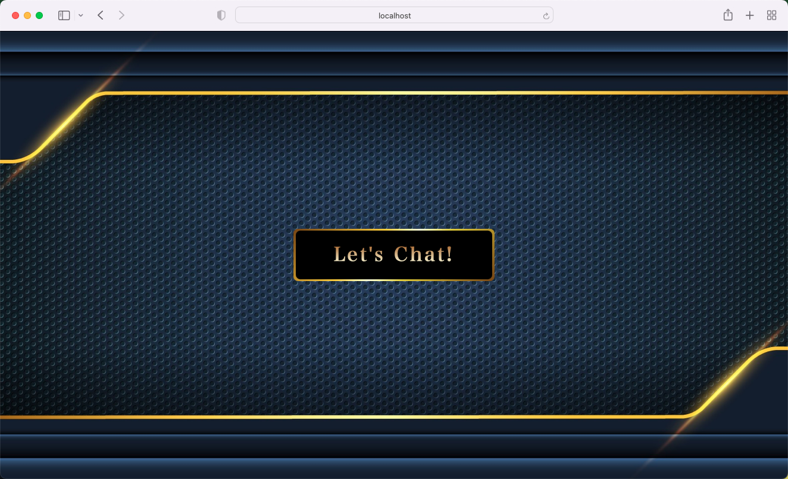
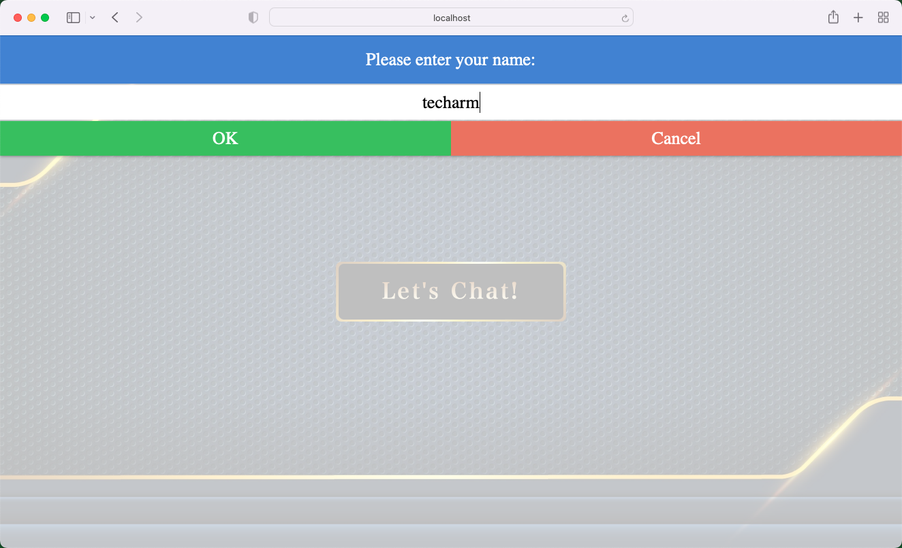
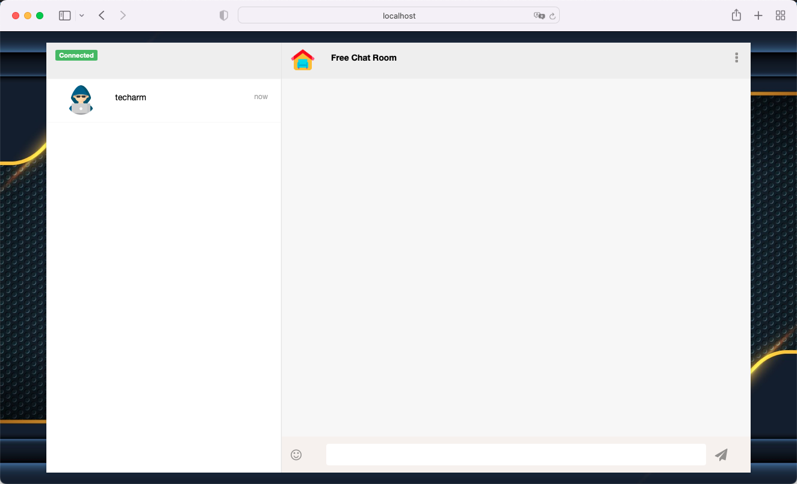
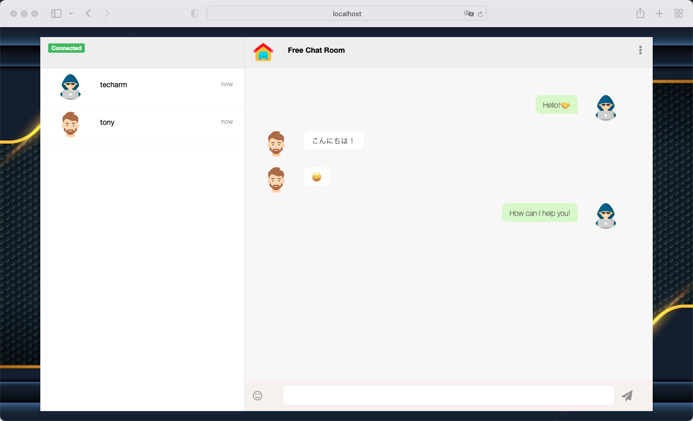

# go-chat
Create simple chat application using WebSockets and Go!

## How to play with it?
```
$ git clone https://github.com/techarm/go-chat.git
$ go run go run ./cmd/web/
```

Now you can use your browser to visit `http://localhost:8080/` to see how it work.

The home page


Enter the user name.


Now you can chat with other people!


Let's chat!

